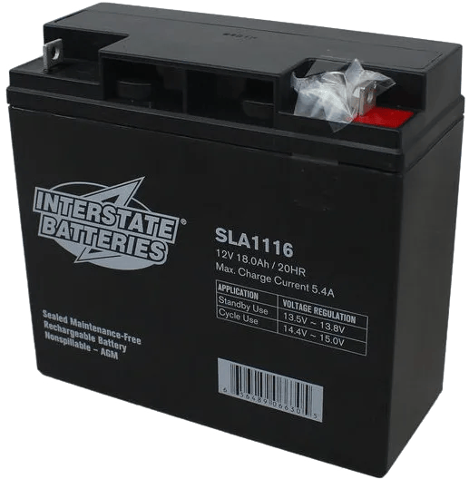
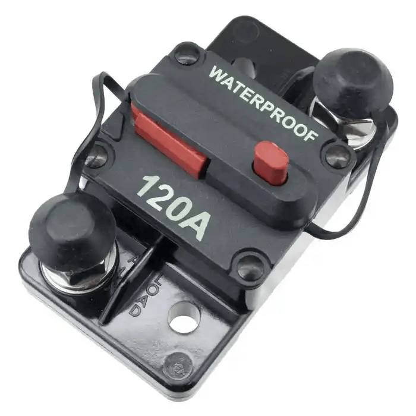
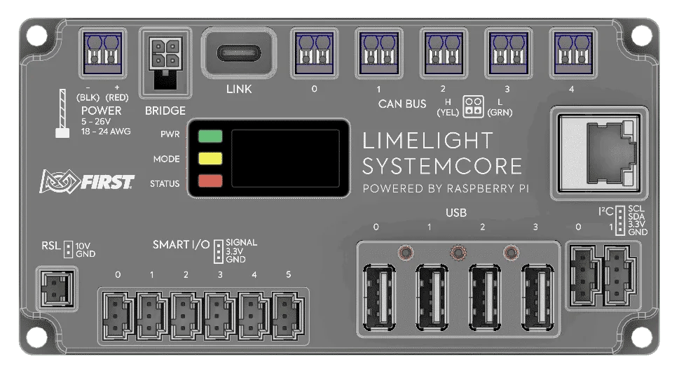
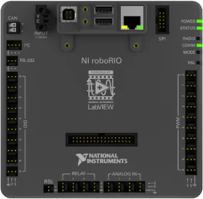

# Core Components Review

Every FRC robot uses the same set of core electrical components. Understanding what each one does, how it connects to the others, and what rules apply to it is essential before you start wiring. This page covers each major component in detail.

> [!Note]
> This page covers the electrical function and wiring of each component. For physical specifications and part numbers, see the [Parts](../parts/parts.md) page.

---

## Battery

The battery is the only power source for the robot. FRC requires a specific battery type: **18 Ah, 12V sealed lead-acid**. All robot power flows from this battery through the main breaker and into the PDH.

Our batteries use [SB50 connectors](https://www.andersonpower.com/product-lines/sb-connector-series/) for easy connection and disconnection from the robot. The negative/ground output from the SB50 connects directly to the PDH using a 6 AWG lug. The positive output connects to one end of the 120A main breaker, and the other end of the breaker connects to the positive input of the PDH.

**Battery rules and best practices:**
- Always use **Anderson SB50 connectors** on the battery leads. Other connectors are not legal.
- Charge batteries using an **approved FRC charger** only. Standard automotive chargers can damage FRC batteries.
- Label batteries with a marker so you know which are charged and which are discharged.
- Never leave a battery fully discharged for an extended period — this permanently reduces capacity.
- Check battery voltage before every match. A battery below 12.0V at rest is considered low.
- Carry multiple batteries to every competition event and make sure you check their status and age. Take the good ones to competitions. 

---

## Main Breaker

The main breaker is a **120A circuit breaker** that acts as the robot’s master power switch. It sits between the battery positive terminal and the PDH positive input. Pressing the red button instantly cuts all power to the robot.

The main breaker serves two purposes: it is the primary **safety disconnect** (anyone can cut power quickly in an emergency), and it is the **overcurrent protection** for the entire robot’s power system.

**Main breaker rules and best practices:**
- The main breaker **must be accessible from the outside of the robot frame** at all times. This is an FRC inspection requirement.
- Mount it in a location that is protected from direct robot-to-robot impacts but still easy to reach.
- Wire from battery (+) → main breaker IN, then main breaker OUT → PDH (+). Battery (-) goes directly to PDH (-).
- Use 6 AWG wire with crimped lugs on both sides of the main breaker.
- Never bypass or substitute the main breaker.

---

## Power Distribution Hub (PDH)

The Power Distribution Hub (PDH) is the central power distribution point for the robot. It takes power from the battery and distributes it to every motor controller, sensor, and control system component. It has **20 high-current channels** (each protected by a snap-action breaker, up to 40A each) and **3 low-current channels** for devices like the RoboRIO and radio.

The PDH also communicates with the RoboRIO over CAN bus, providing real-time current draw data per channel. This is useful for debugging and for monitoring robot health.

The PDH has a **built-in CAN terminator**, which means it must be placed at the end of the CAN chain.

**Breaker sizes by component:**

| Component | Breaker Size |
|---|---|
| Drive motors (Falcon 500, Kraken X60, NEO) | 40A |
| Smaller motors (NEO 550, Minion, etc.) | 20A or 30A |
| RoboRIO | 10A |
| Radio (VH-109) | 10A |
| Pneumatic Hub (PH) | 20A |

> **Note:** Always check the FRC game manual and component documentation for the required breaker size. Using the wrong size can trip breakers during matches or damage components.

**PDH best practices:**
- Mount the PDH in a central, accessible location so breakers can be checked and reset quickly.
- Each channel can be switched on or off in software, which is useful for power management.
- Do not use the VRM (Voltage Regulator Module) for radio power. Power the VH-109 radio directly from a PDH 10A channel.

---

## RoboRIO & System Core

The RoboRIO (and its successor, the SystemCore) is the **main controller** of the robot. It runs your team’s Java/Python/C++ robot code and communicates with all other components via CAN, PWM, DIO, and ethernet.

- **RoboRIO 1** and **RoboRIO 2** are both legal. The RoboRIO 2 is preferred due to better performance and more onboard storage.
- The **SystemCore** is being introduced for the 2027 FRC season as the next-generation controller, replacing the RoboRIO.
- Both the RoboRIO and SystemCore act as **CAN bus masters** and are one of the two required endpoints of the CAN chain.

**Wiring the RoboRIO:**
- Power from a dedicated **10A breaker channel** on the PDH, using 18 AWG wire.
- Connect to the PDH power input terminals using the Weidmuller push-in connectors.
- Connect to the radio via ethernet using the port labeled **"RIO"** on the VH-109.
- PWM headers on the RoboRIO can control motor controllers that do not use CAN.
- The RoboRIO has DIO, AIO, relay, and SPI/I2C ports for sensors and accessories.

---

## Radio (VH-109)

The radio for FRC is the **Vivid-Hosting VH-109**. It handles Wi-Fi 6E (6 GHz) communication between the robot and the Driver Station laptop. The radio must be configured at a FIRST event using the Radio Kiosk before the robot can connect to the field.

**Wiring the radio:**
- Power from a dedicated **10A breaker channel** on the PDH, wired to the Weidmuller DC input on the VH-109.
- Connect the RoboRIO to the port labeled **"RIO"** on the VH-109 using an ethernet cable. Do not use any other port for this connection.
- Mount the radio so its indicator lights are visible. This lets you quickly check connection status from the pit.

**Radio rules:**
- The radio must be updated to the latest firmware before use at official events. 
- At home practice, you need a **second VH-109** acting as an access point to connect the Driver Station laptop to the robot radio. The access point radio must be powered from a wall adapter, not a battery.
- This connection can also be replaced by connecting to the radio's wifi signal as that has the same effect. Usually 8726 doesn't use a second radio for at home practice but that is an option. 
- Do not enclose the radio in metal, as it will block the Wi-Fi signal.

---

## Motor Controllers

Motor controllers sit between the PDH and the motors. They receive a power input from the PDH and control how much power goes to the motor based on commands from the RoboRIO.

**Common motor controllers used in FRC:**

| Controller | Communication | Common Motors |
|---|---|---|
| Talon FX (inside Falcon 500 / Kraken X60) | CAN | Falcon 500, Kraken X60 (integrated) |
| Talon FXS | CAN | Minion, other brushless/brushed motors |
| SPARK MAX | CAN or PWM | NEO, NEO 550 |
| SPARK Flex | CAN or PWM | NEO Vortex |
| Thrifty Nova | CAN or USB | NEO, other brushless motors |
| Talon SRX | CAN or PWM | CIM, Mini-CIM, brushed motors |
| Victor SPX | CAN or PWM | Brushed motors (legacy use) |

**Wiring a motor controller:**
1. Connect the controller power input (red/black) to a PDH channel with the correct breaker.
2. Connect the motor output wires to the motor.
3. If using CAN, daisy-chain the CAN wires through the controller.
4. If using PWM, connect a PWM cable from the controller to a PWM header on the RoboRIO.

> **Important:** Each motor controller must have a unique CAN ID set using a configuration tool (REV Hardware Client for SPARK MAX/Flex, Phoenix Tuner X for CTRE devices). Duplicate IDs will cause unpredictable behavior. See [CAN Bus](can_bus.md) for details.

---

## VRM (Voltage Regulator Module)

The VRM is a legacy component that provided regulated 12V and 5V outputs for cameras, sensors, and radios in older FRC setups. In current FRC configurations with the VH-109 radio, the VRM is **not used for radio power**.

The VRM may still be used on some robots to power custom sensors or cameras that require a regulated 12V or 5V supply, but it is not required and is not part of the standard control system wiring.

> Do not use the VRM to power the VH-109 radio. The radio requires a direct PDH connection.
