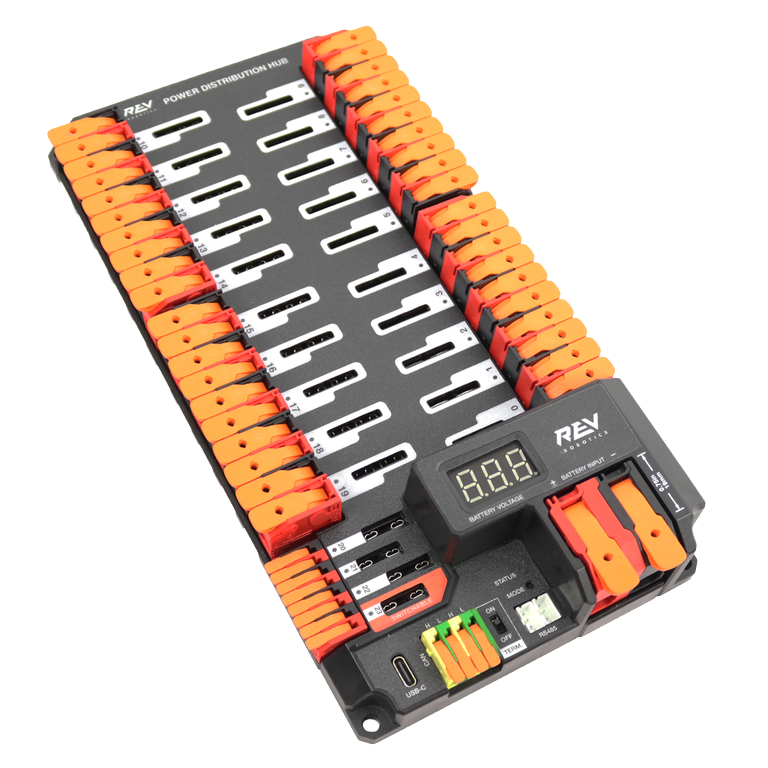

# Core Components Reviewed

Welcome to the Electrical Docs! On this page, we're going to go over the basic components that make up our robots. This includes:
- Power Distribution Hub
- System Core and Roborio
- Radio
- Battery and Breaker
- Motor Controllers
- VRM
- Can Bus

> [!Note]
> This page only offers a quick review of components and ties them to the electrical 
> and wiring process. For more information on each of these parts, view the [Parts](../parts/parts.md)
> page.

## The Power Distribution Hub

The Power Distribution Hub (PDH) is a central component that connects to the battery and every other part to supply power to the robot.