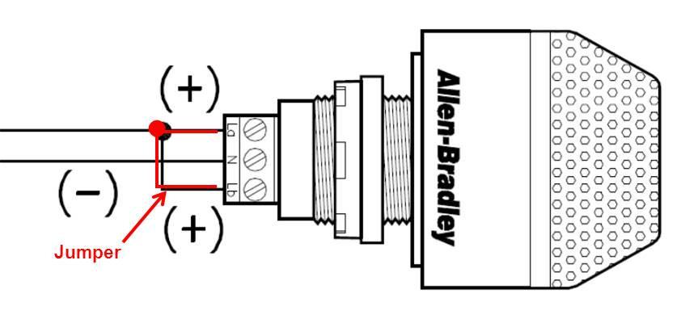

ismail - not proofread
# RSL

## Overview

The RSL is a large LED light used to determine the current status of the robot; it is mandatory for competition. The robot's status is determined by 3 different modes:

| -------------- | ------------------------------------ |
| ON and SOLID   | Robot is on and disabled             |
| ON and BLINKING| Robot is on and enabled              |
| OFF            | Robot is off, RSL not wired properly |

## Ports

The RSL has 3 power ports. The middle port is for the negative terminal (black wire). The two outer ports are for the positive terminal (red wires).

Run the main red wire through `La`, then connect `La` and `Lb` with a separate red wire that will act as a jumper cable. Connect `La` to `S` and `N` to Ground on the roboRIO.

## Official Documentation and Manuals

[WPILIB Hardware Overview](https://docs.wpilib.org/en/stable/docs/controls-overviews/control-system-hardware.html)
[WPILIB Status Light Reference](https://docs.wpilib.org/en/stable/docs/hardware/hardware-basics/status-lights-ref.html)
