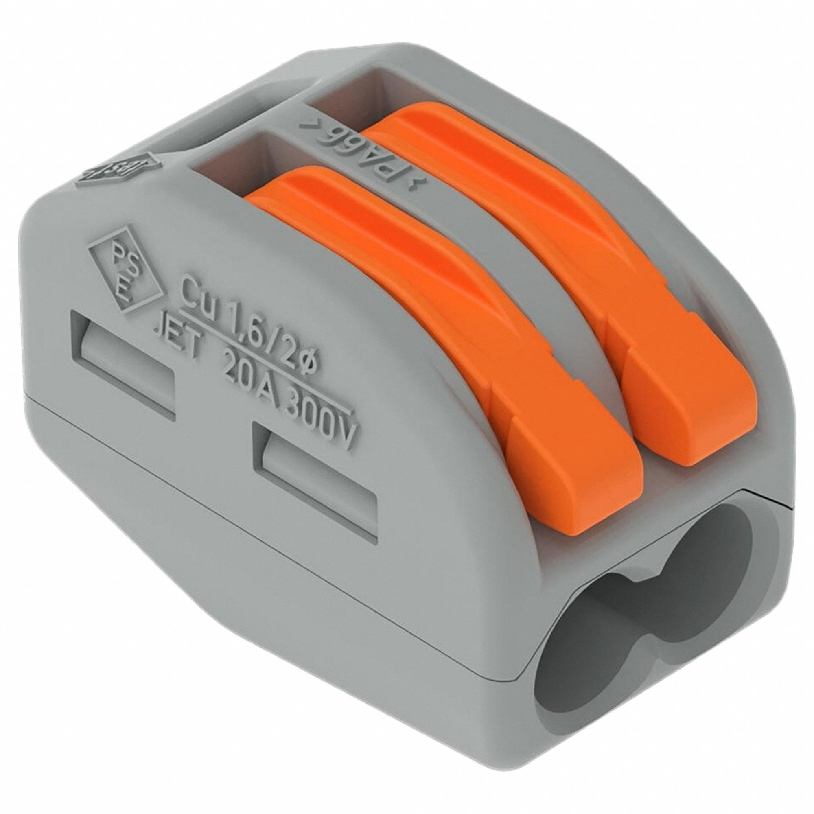
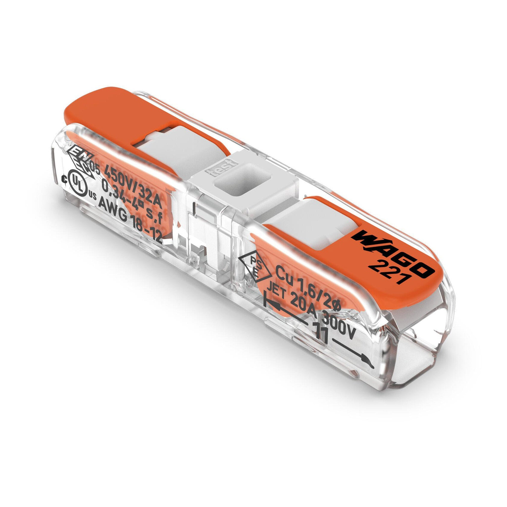

- ismail, not proofread
# Wagos

`Ani's WAGOs`

This part can be found in the Mechroom inside the electrical bin.

## What is this?

WAGOs are wire connectors that allow wires to splice together without the need to sauder or use screws. Using them, wires can easily secure in place and be interchanged when needed. 

8726 mainly uses 2 types of WAGOs. Gray WAGOs (Image 1) are used to connect wires with a guage of at least 28 AWG (i.e CAN and Encoder wires). Clear WAGOs with orange tops (Image 2) are usually used to connect power wires; they may also be used to connect high-guage wires if we run out of gray WAGOs. 

## Common issues

The following are some common issues that may arise when using WAGOs, along with some solutions.

| Problem         | Solution   |
| ------------ | ----------- |
| Wires come off easily with little force. | Ensure that the wire is stripped enough, restrip the wire if need be. |
| Connection not working or wires not being powered  | Make sure that the wire is not frayed or missing strips. You may need to either restrip the wire or use a different one entirely.   |
| Wires don't fit  | Make sure that the WAGO being used is of the correct gauge. Restrip the wire if it is not stripped properly.  |
