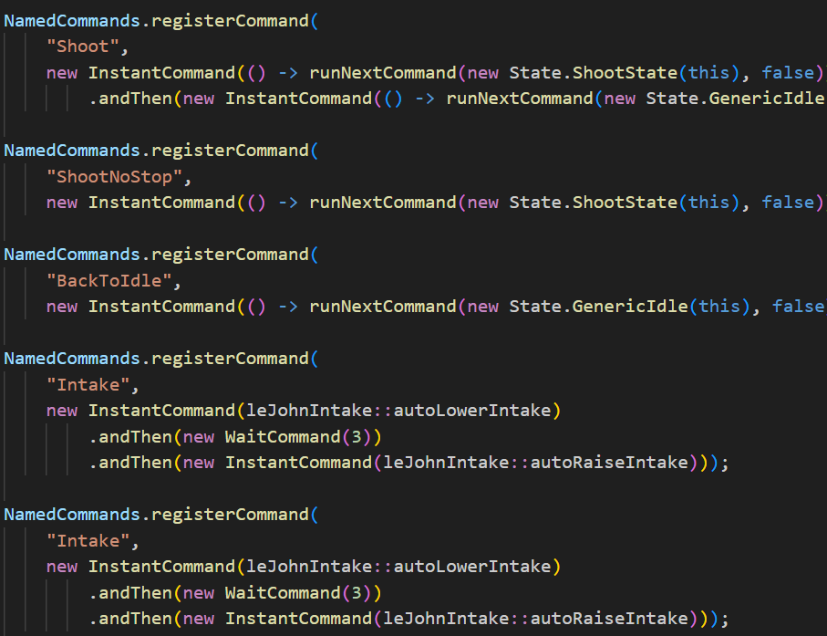
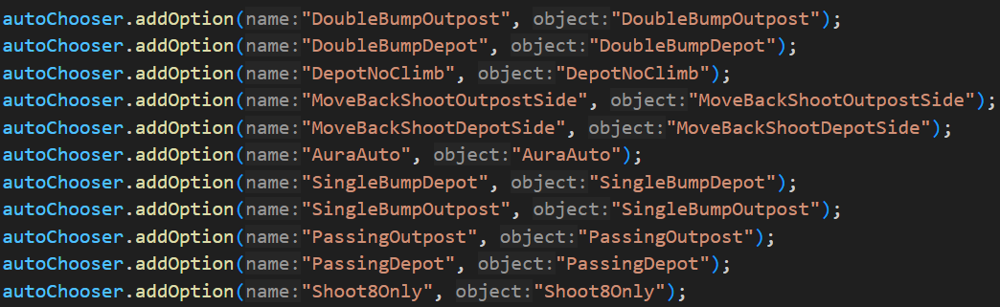

# Programming Autos

Autos don't touch programming too much. The only programming autonomous routines need are implementing custom commands and adding paths into the dashboard.

## Custom Commands

Depending on the game for the year, different commands are needed like shoot or raising the elevator.

Here are examples of commands from REBUILT:

## Adding Paths to the Dashboard

During competition, paths will be selected on the dashboard.

Here are examples of adding commands to a dashboard:

