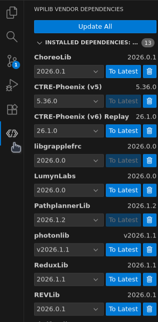

(Needs proofreading! Written by: Dhruva)

# Overview of WPILib and Robot Code

## Basics of Robot Code

Our team uses Java to program our robots. This code is run on the robot's central processor, either in a
[roboRIO](../parts/rio.md) (used in previous years) or a [SystemCore](../parts/system_core.md) (used after 2026).
Code run here will be able to control any devices connected to the roboRIO or SystemCore via USB, Ethernet, or CAN,
and communicate with the FMS (Field Management System) or a laptop during testing to react to inputs
from the driver and send/receive other data over the network such as camera streams or debugging info.

> [!NOTE]
> There are many publicly available resources for gaining a basic understanding of Java, such as
> [w3schools](https://www.w3schools.com/java/) and [codecademy](https://www.codecademy.com/learn/learn-java).
> Basic skills with Java are obviously necessary to write robot code and all control members will learn
> some basic Java. However, this guide will not teach you basic Java programming skills.

Java code is written in plain text in .java files, and then compiles to a .jar file. The compiled
.jar file can be run by a program called the Java Virtual Machine, so it can easily be run either
by the robot or on team laptops to simulate robot code for debugging purposes. Most of these processes
are automated and described in the later [How do we build and deploy robot code?](#how-do-we-build-and-deploy-robot-code)
section.

## What is WPILib?

WPILib is a library and suite of tools designed for use when programming FRC robots. As a library, it contains
a lot of useful code we can access in the form of Java classes. This greatly simplifies interfacing with common
things in FRC and performing common tasks such as running certain types of control theory. WPILib also provides
a general project structure and several frameworks such as Commands which we make use of when programming the robot.

Additionally, WPILib comes with several other tools. These are explained in more detail in
[their dedicated section in the software chapter](../software/wpilib.md), but include tools for
debugging such as [Glass](../software/wpilib.md#glass) as well as a custom build of Visual Studio Code which we typically use for
development.

We also use several other libraries in our robot code, such as REVLib and PhoenixLib which contain utilities to interact with REV and CTRE Phoenix devices.
These libraries are managed through WPILib's vendor dependency system. To view and manage vendor dependencies, click on the WPILib logo on the far left of
VS Code, which will open this menu:

## How do we write robot code?

Our team primarily writes robot code in WPILib's custom build of VS Code, which also allows us to easily simulate
and debug robot code, and has standard useful features such as autocomplete and error highlighting. We also use Git to
track changes made to robot code and host it on GitHub so everyone on the team can have shared access to the code
(for more information on these see [their dedicated section](../git/git.md)).

Beyond that, most of it is a standard Java project. Please be sure to document your code where necessary to make
life easy for others - remember, other people need to read your code too!

> [!Note]
> This VS Code build uses Red Hat's Java LSP support, which is... awful.
> It often takes a while to start up, so if you don't see autocomplete or errors/warnings
> popping up after starting VS Code, you may need to wait a few seconds. However, if it takes
> longer than ~1 minute, you may need to run then `Java: Clean Java Language Server Workspace` command
> in VS Code, and then when you click `Reload and Delete` it should start working after a few seconds.
> This happens A LOT, especially on team laptops.

## How do we build and deploy robot code?

WPILib projects are built using [Gradle](https://gradle.org/). Gradle is a build system which handles dependencies,
versioning, build options, and the entire compilation process. It is configured in the `build.gradle` file at the root
of any WPILib project, however,
most tasks you need to do are abstracted by WPILib so you likely will not need to edit this file. In order to run
gradle or specific tasks in gradle, you can run the `gradlew` (mac/linux) or `gradlew.bat` (windows) scripts, however
most things you may need to do can be run more quickly as VS Code commands added in WPILib's build of VS Code.

Pressing Ctrl+Shift+P brings up the command prompt in VS Code, and if you search for `WPILib` you can see all of the
commands added by WPILib. You can also click the WPILib logo in the top right corner to quickly bring up these commands.

If you run `Build Robot Code`, a .jar file will be built containing the compiled robot code. If there have been any changes to
the dependencies since that last time robot code was built, this will require internet and may take some time while
new/updated dependencies are downloaded.

Running `Simulate Robot Code` will first build the robot code and then simulate it on your computer. It is
generally recommended to choose the `Sim GUI` option, which
opens [Glass]() so you can view information about the code and send inputs to the robot.

Running `Deploy Robot Code` is how we actually get robot code onto the robot. This will automatically connect to
the robot via internet if you are on the radio's WiFi or tethered to it by an ethernet cable. Then, robot
code is built, and the .jar file along with everything in the `src/main/deploy/` directory is copied over to the robot's
internal storage. The `src/main/deploy` directory is often used to send information generated by other programs such as
Choreo, PathPlanner, and the configuration for our robot's swerve drive, which will be explained in later sections.

## How is robot code organized?

Our robot code follows WPILib's project structure.
Inside the `src/main` folder there is a `java` folder containing all java source
code and a `deploy` folder containing other files that should be copied over to the 
robot. Within the `java` folder all our code should be contained in `frc/robot`.
The `Main.java` file contains the entry point. You should not edit this.
`Robot.java` contains mostly boilerplate and is rarely edited. `RobotContainer.java` contins
most of the larger logic around the robot, and its constructor contains tasks run on startup.
Then, we have some utility files such as `util/Constants.java` which contains various
constant values for physical information or settings.

The bulk of robot code is organized into separate "subsystems" which usually follow
the physical subsystems on the robot (intake, outtake, arms, elevators, shooters, etc).
These are in the `subsystems` folder (duh).