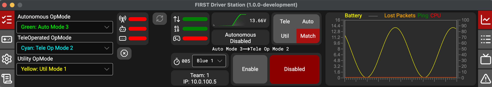
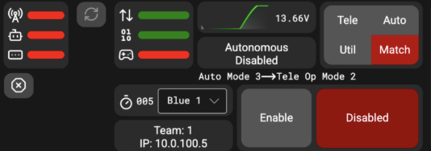

# FIRST Driver Station (written by Ron, needs proofing)

## Where to download/update

Download: [FIRSTDriverStation](https://github.com/wpilibsuite/FirstDriverStation-Public/releases)

Linked above is the official download link of the FirstDriverStation, this application needs to be updated manually (As of August 1st 2026). Download the version that matches your operating system and processing unit, it is listed on the GitHub release page below.

## Description

Driver Station is the main control panel for your FRC Robot. It manages your Teleoperated, and Autonomous routines during practice. The Driver Station acts as a communicator between your controller and the robot. As well, this is the station you will use during the 2 Match Weeks you have during the season, by connecting to the Ethernet provided behind the glass.

## How to use

Above is the updated version of Driver Station for the 2027 FRC season, this is the main control panel you will see when testing the robot, and competing during the competition. We will go through what each part means in the station.

The main control panel is shown above. In the top left we can see the connectivity with the robot and the FMS station. On the right, we can see the connectivity between the Robot marked by the arrows, we can see the robot code marked by the 0110, and the controller connectivity marked by the controller, before we start a match or a practice we want to see all greens on the panel. Below this connectivity panel we can select which team we are, Red/Blue (1-3). As well we see a graph of the battery voltage, during matches and practices we always want to see this over 12V, anything below 12V means that we are “browning out” which means we need a battery switch. Below the battery voltage we can see the status of the robot whether we are in Auto or Teleop, and whether we are Enabled or Disabled, make sure the robot is disabled every time you are not running the robot. On the top right, we can choose between Teleoperated, Autonomous, Match, and Utilities, changing these modes depending on the type of testing you are doing. When this program gets updated, you will be able to see match timers when you run the robot.

Above we can see the beginning part of the settings, we can see the Team Number (always keep this on 8726, unless you’re not 8726 :P). Keep the Window Mode to DOCKED as Aluminum (our team's custom Driver Dashboard) will fit to it. Use the Game Data value set to send data to our robot.

When we scroll down to this part, make sure that you reset the Robot Code anytime you update or pull code from GitHub. Then make sure that you always reset times to the FRC standard (because we are in FRC :D). Leave everything unchecked unless necessary or directed to do so.
Official Resources

Linked below are some resources to aid your journey, if more help is necessary, ask the Driver, Operator, or Technician. Have fun!

[CheifDelphi Discussion Post](https://www.chiefdelphi.com/t/wpilib-blog-the-2027-first-driver-station/519275)

[WPILib Documentation](https://wpilib.org/blog/the-2027-first-driver-station)

