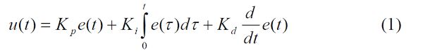

(Needs proofreading! Written by: Keshav)

# The Equation



## Understanding the Equation

Now that we understand what a PID controller is and why it exists, we can begin looking at the mathematics behind it. While the PID equation may initially appear intimidating, it is actually composed of three very simple ideas that work together to produce an effective controller. Each term represents a different way of looking at the same quantity: the error.

The complete PID equation is

\[
u(t)=k_Pe(t)+k_I\int e(t)\,dt+k_D\frac{de(t)}{dt}
\]

where

- \(u(t)\) is the output of the controller
- \(e(t)\) is the current error
- \(k_P\) is the proportional gain
- \(k_I\) is the integral gain
- \(k_D\) is the derivative gain

The output of this equation is then sent to the motors. Depending on the implementation, this output may represent a voltage, a percent output, a torque request, or some other control signal. In FRC, the output is often interpreted as a voltage which is then combined with feedforward before being applied to the motors.

Although this equation looks complicated, it is simply adding together three separate corrections.

- The proportional term looks at the **present**.
- The integral term looks at the **past**.
- The derivative term predicts the **future**.

By combining these three perspectives, a PID controller is capable of producing fast, accurate, and stable motion for many different types of systems.

---

## Error

Every calculation performed by a PID controller begins with one value known as the **error**.

The error is simply the difference between where the mechanism currently is and where we want it to be.

\[
e(t)=\text{Setpoint}-\text{Measurement}
\]

Suppose we want our arm to rotate to \(90^\circ\).

If the arm is currently at \(60^\circ\),

\[
e=90-60=30^\circ
\]

The controller now knows that it still needs to move another \(30^\circ\).

Now suppose the arm overshoots and reaches \(95^\circ\).

\[
e=90-95=-5^\circ
\]

Notice that the error is now negative. This tells the controller that the mechanism has traveled too far and must move in the opposite direction.

A PID controller continually recalculates this error every control loop. In WPILib, this occurs approximately every 20 milliseconds. As the mechanism moves, the error changes, and so does the output of the controller.

It is important to note that the controller does not know anything about the physical system itself. It does not know how heavy the mechanism is, how much friction exists, or how powerful the motors are. All it knows is the current error and how that error changes over time.

---

# \\(k_P\\)

The proportional term is by far the simplest part of the PID controller and is often the only term beginners understand initially. Despite its simplicity, it is usually responsible for the majority of the controller's behavior.

The proportional term is

\[
k_Pe(t)
\]

This equation simply states that the output of the controller should be proportional to the current error.

---

## Direct Proportionality

In mathematics, two quantities are said to be directly proportional if increasing one causes the other to increase by the same factor.

For example,

\[
y=5x
\]

is a proportional relationship.

If \(x\) doubles, then \(y\) also doubles.

If \(x\) becomes three times larger, then \(y\) also becomes three times larger.

The proportional term behaves exactly the same way.

Suppose our proportional gain is

\[
k_P=0.2
\]

If the current error is

\[
e=10
\]

then the controller produces

\[
0.2\times10=2
\]

units of output.

If the error suddenly doubles,

\[
e=20
\]

then the output also doubles.

\[
0.2\times20=4
\]

Nothing about the controller changes. The only thing that changed was the size of the error.

This simple relationship allows proportional control to naturally apply large corrections when the mechanism is far away from its goal while automatically reducing those corrections as the mechanism approaches its target.

---

## Physical Interpretation

Imagine trying to push a shopping cart toward a wall.

If the cart is twenty feet away, you would probably push it fairly hard.

As it gets closer to the wall, you naturally begin pushing more gently.

Eventually, when the cart reaches the wall, you stop pushing entirely.

This is exactly how proportional control behaves.

Large errors produce large outputs.

Small errors produce small outputs.

Zero error produces zero output.

This behavior makes proportional control incredibly intuitive and is the primary reason why it forms the foundation of almost every PID controller.

---

## Why \\(k_P\\) Works

One of the biggest strengths of proportional control is that it automatically slows the mechanism as it approaches the target.

Suppose a mechanism begins 100 encoder ticks away from its goal.

Initially, the error is very large, so the controller commands a large output to move the mechanism quickly.

As the mechanism gets closer, the error shrinks.

Since the output is proportional to the error, the commanded output also shrinks.

This creates a smooth deceleration without requiring any additional logic.

Many beginning programmers attempt to manually reduce motor power near the target. A proportional controller performs this automatically because the mathematics naturally produce that behavior.

---

## Limitations of Proportional Control

Although proportional control works remarkably well, it is rarely perfect.

Imagine an arm that must hold itself horizontal against gravity.

As the arm approaches its target, the error becomes smaller.

Since the error is becoming smaller, the proportional output also becomes smaller.

Eventually, the controller may not produce enough output to completely overcome gravity.

The arm stops slightly below its desired position.

The controller has reached a balance where the motor torque exactly matches gravity, even though a small error still exists.

This remaining error is known as **steady-state error**.

Steady-state error is one of the primary reasons why the integral term exists.

Another limitation is oscillation.

If the proportional gain is too small, the mechanism responds sluggishly.

If the proportional gain is too large, the controller reacts too aggressively and repeatedly overshoots the target.

Finding a good proportional gain is therefore a balance between responsiveness and stability.

Despite these limitations, the proportional term usually contributes the largest portion of the controller's output and should almost always be tuned before the other two gains.

# \(k_I\)

The integral term is often considered the most difficult part of a PID controller because it introduces a concept from calculus. Fortunately, understanding the idea behind the integral is much more important than understanding the mathematics used to derive it.

The integral term is

\[
k_I\int e(t)\,dt
\]

Unlike the proportional term, which only considers the current error, the integral term considers **every error that has occurred since the controller began running**. Rather than asking *"How large is the error right now?"*, it asks *"How much total error has accumulated over time?"*

For this reason, the integral term is often described as giving the controller a memory. While the proportional term immediately forgets the previous error every time a new measurement is taken, the integral term remembers every previous error and continuously adds them together.

---

## Understanding Integration

If you have studied calculus before, you may know that an integral represents the area underneath a curve. While this definition is mathematically correct, it can be difficult to see why that has anything to do with PID control.

Instead, imagine measuring the error once every second and writing each measurement down on a sheet of paper.

Suppose the errors are

```
5
4
4
3
2
```

Rather than looking only at the most recent value, we could simply add all of these measurements together.

```
5+4+4+3+2=18
```

This total represents the amount of error that has accumulated over time.

The integral performs this same idea continuously instead of only at discrete moments. Rather than adding measurements taken once every second, it adds infinitely many measurements taken over infinitely small intervals of time.

This continuous accumulation is written mathematically as

\[
\int e(t)\,dt
\]

Although the notation appears complicated, the underlying idea is simply keeping a running total of the error.

---

## Why Accumulation Matters

At first glance, accumulating error may seem unnecessary. After all, shouldn't the controller only care about where the system is right now?

The answer is no.

Imagine a system that consistently remains one unit below its desired value.

The proportional controller sees an error of one unit and produces a small correction.

Unfortunately, this correction is not quite large enough to eliminate the remaining error.

The system settles into a state where it remains one unit away from the target indefinitely.

Since the error never changes, the proportional controller also never changes its output.

The integral term behaves differently.

Every moment that the error remains at one unit, another unit of error is added to the accumulated total.

Initially, the accumulated error is very small.

After several seconds, however, the accumulated error becomes much larger than the original error itself.

As this accumulated error grows, the controller produces increasingly larger corrections until the remaining error finally disappears.

For this reason, the integral term is often described as eliminating **steady-state error**. Rather than reacting only to the size of the current error, it reacts to how long that error has existed.

---

## Continuous Mathematics and Real Computers

The mathematical definition of the integral assumes that the controller can continuously measure the error at every instant in time.

Real computers cannot do this.

Instead, they periodically sample the system and approximate the integral by repeatedly adding small pieces together.

If the controller executes every \(\Delta t\) seconds, the accumulated error can be approximated as

\[
I_{\text{new}}=I_{\text{old}}+e\Delta t
\]

Rather than computing the exact area underneath the error curve, the computer approximates that area using many very small rectangles.

As the sampling interval becomes smaller, this approximation becomes increasingly close to the true mathematical integral.

This idea is known as **numerical integration** and is used throughout science, engineering, and computer simulation whenever a continuous mathematical process must be performed on a digital computer.

---

## Choosing \\(k_I\\)

The accumulated error itself is rarely used directly.

Instead, it is multiplied by a constant known as the integral gain,

\[
k_I.
\]

This gain determines how strongly the accumulated error influences the controller's output.

A larger value causes the controller to react more aggressively to long-lasting errors.

A smaller value causes the accumulated error to have a weaker influence on the controller.

Unlike the proportional gain, changing the integral gain has very little effect on the controller's initial response. Instead, it primarily affects how the controller behaves after an error has persisted for some period of time.

---

## Integral Windup

Although the integral term can eliminate steady-state error, it also introduces one of the most common problems encountered when designing PID controllers.

Suppose a controller attempts to move a system toward its target, but the system is physically unable to move.

Since the error remains large, the integral continues accumulating error.

As more and more error is accumulated, the controller produces increasingly larger outputs even though nothing has changed.

Eventually, the obstacle preventing the system from moving is removed.

At this point the controller has accumulated an enormous amount of error.

Instead of smoothly approaching the target, the controller immediately commands a very large correction, causing the system to overshoot dramatically.

This phenomenon is known as **integral windup** because the accumulated error continues "winding up" while the controller is unable to reduce the error.

Modern PID implementations often include anti-windup techniques that prevent the accumulated error from becoming excessively large. Although these methods vary, they all attempt to limit the controller's memory so that it remains useful without becoming unstable.

# \(k_D\)

The derivative term is the final component of a PID controller and is often the most misunderstood. Unlike the proportional term, which measures the current error, and the integral term, which measures the accumulated error, the derivative term measures **how quickly the error is changing**.

The derivative term is

\[
k_D\frac{de(t)}{dt}
\]

Rather than asking *"How far away am I?"* or *"How long have I been away?"*, the derivative term asks

> **"How quickly is the error changing?"**

Because of this, the derivative term acts somewhat like a predictor. Although it cannot actually determine the future, it can observe the current trend of the error and estimate where the system is heading if nothing changes.

---

## Understanding Derivatives

If you have studied calculus before, you may recognize the derivative as the slope of a function.

Suppose we have a function

\[
f(x)
\]

The derivative

\[
\frac{df}{dx}
\]

describes how quickly the function changes with respect to its input.

For example, consider a car traveling down a road.

The car's position changes over time.

If we differentiate its position,

\[
\frac{dx}{dt},
\]

we obtain its velocity.

Differentiating once again,

\[
\frac{d^2x}{dt^2},
\]

gives its acceleration.

Derivatives therefore describe **rates of change**. They tell us not only what a value currently is, but how rapidly that value is increasing or decreasing.

PID applies this exact same idea to the error.

Instead of differentiating position or velocity, it differentiates

\[
e(t).
\]

The resulting quantity tells us how quickly the error itself is changing.

---

## Why Does This Help?

Suppose a system is moving rapidly toward its desired position.

Although the current error may still be fairly large, it is shrinking very quickly.

A proportional controller only sees the size of the error.

It continues commanding a large output because it has no knowledge of how fast the system is already moving.

This often causes the system to overshoot its target.

The derivative term sees something different.

It notices that the error is decreasing rapidly.

Since the controller is already approaching the target quickly, the derivative term begins reducing the controller output before the target is reached.

Rather than waiting for the overshoot to occur, the derivative term begins slowing the system early.

For this reason, derivative control is often described as adding **damping** to a system.

---

## Damping

One useful way to visualize the derivative term is to imagine a spring attached to a shock absorber.

A spring naturally wants to pull an object toward its equilibrium position.

If there is no friction or damping, the object repeatedly overshoots the equilibrium point and continues oscillating back and forth.

This behavior is very similar to a proportional controller with a large proportional gain.

Now imagine adding a shock absorber.

The spring still pulls the object toward equilibrium, but the shock absorber resists rapid motion.

Instead of oscillating repeatedly, the object settles smoothly.

The derivative term performs a similar role.

Rather than resisting displacement like the proportional term, it resists **rapid changes** in the error.

The faster the error changes, the larger the derivative contribution becomes.

This naturally reduces oscillation and allows the system to settle more quickly.

---

## How Computers Compute Derivatives

The mathematical definition of the derivative is

\[
\frac{de(t)}{dt},
\]

which assumes that the error can be measured continuously.

Like the integral, this cannot be computed exactly by a digital computer.

Instead, computers approximate the derivative using the change in error between two consecutive measurements.

This approximation is

\[
\frac{e_{\text{current}}-e_{\text{previous}}}{\Delta t}
\]

where

- \(e_{\text{current}}\) is the current error,
- \(e_{\text{previous}}\) is the previous error,
- and \(\Delta t\) is the elapsed time between measurements.

This quantity is known as a **finite difference approximation** and is one of the most common methods of estimating derivatives numerically.

As the sampling interval becomes smaller, this approximation becomes increasingly close to the true mathematical derivative.

---

## Why Does Derivative Amplify Noise?

One disadvantage of differentiation is that it reacts strongly to small fluctuations in the measured signal.

Imagine a sensor measuring

```
100
101
100
101
100
```

Although these measurements vary by only one unit, the derivative changes sign every time a new measurement is taken.

The controller interprets these rapid changes as the system constantly changing direction, even though the variation is simply measurement noise.

For this reason, the derivative term often produces noisy outputs when used with low-quality or noisy sensors.

Many practical control systems reduce this problem by filtering sensor measurements before computing the derivative or by filtering the derivative itself.

---

## Choosing \\(k_D\\)

The derivative itself only measures how quickly the error changes.

To determine how strongly this information should influence the controller, it is multiplied by the derivative gain,

\[
k_D.
\]

Increasing \(k_D\) causes the controller to react more strongly to rapid changes in the error.

This generally reduces overshoot and oscillation while allowing the system to settle more quickly.

However, excessively large derivative gains can cause the controller to become overly sensitive to measurement noise, resulting in unstable or erratic outputs.

Finding an appropriate derivative gain therefore requires balancing responsiveness against sensitivity to noise.

---

## Looking at the Entire Equation

Each term of the PID controller examines the error from a different mathematical perspective.

The proportional term considers the current error.

\[
k_Pe(t)
\]

The integral term considers the accumulated history of the error.

\[
k_I\int e(t)\,dt
\]

The derivative term considers the rate at which the error is changing.

\[
k_D\frac{de(t)}{dt}
\]

Together, these three terms produce the complete PID equation,

\[
u(t)=k_Pe(t)+k_I\int e(t)\,dt+k_D\frac{de(t)}{dt}.
\]

One way to summarize the equation is to think of each term as observing the error from a different point in time.

- The proportional term responds to the **present**.
- The integral term remembers the **past**.
- The derivative term estimates the **future**.

Individually, each of these approaches has significant limitations. Together, however, they produce a controller capable of accurately controlling a wide variety of physical systems, which is why PID remains one of the most widely used control algorithms in engineering today.
